# PVE SMB Gateway - User Process Flow

## Overview

This document provides a comprehensive flow diagram of the user process flow for the PVE SMB Gateway plugin, covering all deployment modes, configuration options, and user interactions from initial setup to ongoing management.

## High-Level User Journey

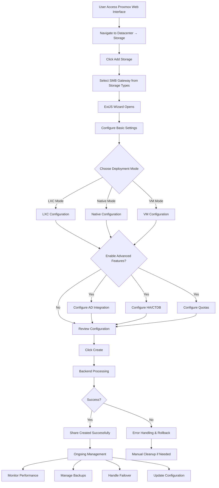

## Detailed Process Flows

### 1. Initial Setup and Configuration

```mermaid
flowchart TD
    A[User Starts] --> B[Access Proxmox Web Interface]
    B --> C[Navigate to Datacenter → Storage]
    C --> D[Click Add Storage Button]
    D --> E[Storage Type Selection Dialog]
    E --> F[Select SMB Gateway]
    F --> G[ExtJS Wizard Opens]
    
    G --> H[Basic Configuration Panel]
    H --> I[Enter Share Name]
    I --> J[Select Deployment Mode]
    
    J --> K{Mode Selection}
    K -->|LXC| L[LXC Mode Configuration]
    K -->|Native| M[Native Mode Configuration]
    K -->|VM| N[VM Mode Configuration]
    
    L --> O[Configure Path]
    M --> O
    N --> O
    
    O --> P[Set Quota (Optional)]
    P --> Q[Advanced Features Panel]
    
    Q --> R{Enable AD Integration?}
    R -->|Yes| S[AD Configuration]
    R -->|No| T[Skip AD Setup]
    
    S --> U[Enter Domain Name]
    U --> V[Enter AD Credentials]
    V --> W[Configure OU (Optional)]
    W --> X[Set Fallback Authentication]
    
    T --> Y{Enable HA/CTDB?}
    X --> Y
    
    Y -->|Yes| Z[HA Configuration]
    Y -->|No| AA[Skip HA Setup]
    
    Z --> BB[Enter VIP Address]
    BB --> CC[Select Cluster Nodes]
    CC --> DD[Configure Failover Settings]
    
    AA --> EE[Review Configuration]
    DD --> EE
    
    EE --> FF[Validation Check]
    FF --> GG{Validation Pass?}
    
    GG -->|Yes| HH[Create Share]
    GG -->|No| II[Show Error Messages]
    
    II --> JJ[User Fixes Issues]
    JJ --> FF
```

### 2. Deployment Mode-Specific Flows

#### LXC Mode Flow

```mermaid
flowchart TD
    A[LXC Mode Selected] --> B[Template Discovery]
    B --> C{Template Found?}
    
    C -->|Yes| D[Use Existing Template]
    C -->|No| E[Download Debian Template]
    
    D --> F[Create LXC Container]
    E --> F
    
    F --> G[Configure Container Resources]
    G --> H[Set Memory Limit (128MB)]
    H --> I[Configure Network]
    I --> J[Create Bind Mount]
    J --> K[Start Container]
    
    K --> L[Install Samba in Container]
    L --> M[Configure Samba]
    M --> N{AD Integration?}
    
    N -->|Yes| O[Join AD Domain]
    N -->|No| P[Configure Local Auth]
    
    O --> Q[Configure Kerberos]
    P --> R[Set Up Local Users]
    
    Q --> S{HA Enabled?}
    R --> S
    
    S -->|Yes| T[Install CTDB]
    S -->|No| U[Start Samba Services]
    
    T --> V[Configure CTDB Cluster]
    V --> W[Set Up VIP]
    W --> U
    
    U --> X[Apply Quotas]
    X --> Y[Share Ready]
```

#### Native Mode Flow

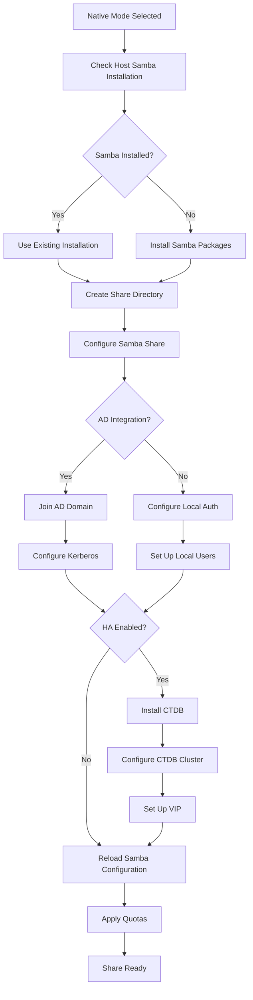

#### VM Mode Flow

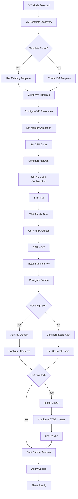

### 3. Active Directory Integration Flow

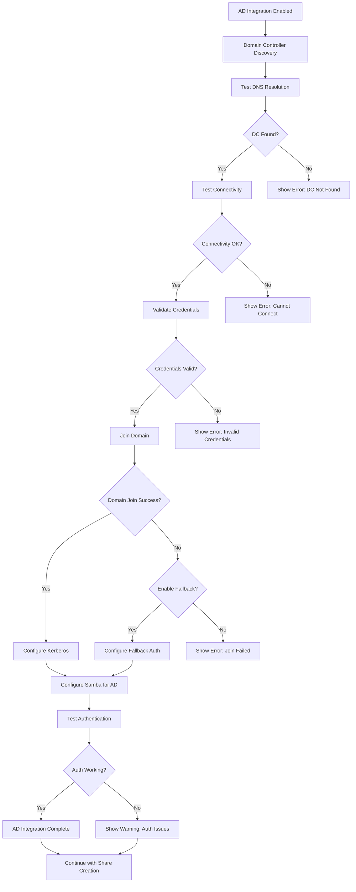

### 4. High Availability (CTDB) Flow

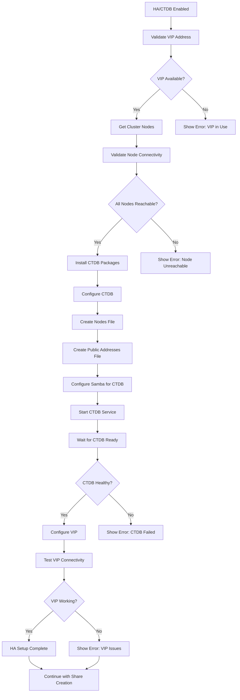

### 5. Quota Management Flow

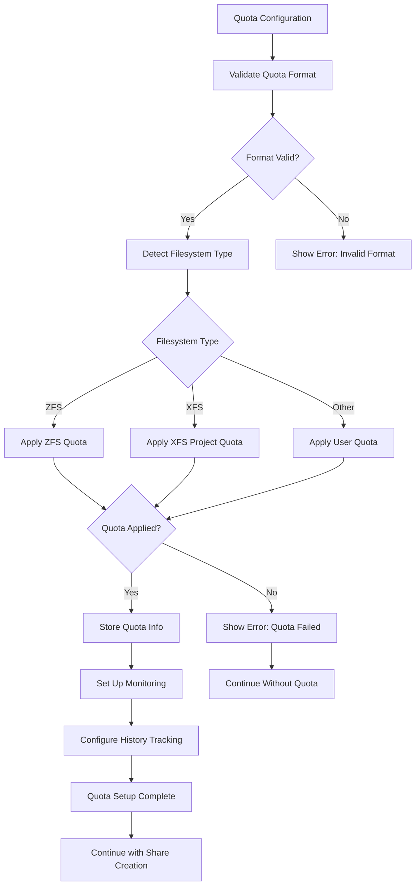

### 6. Error Handling and Rollback Flow

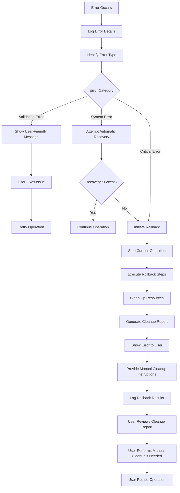

### 7. Ongoing Management Flow

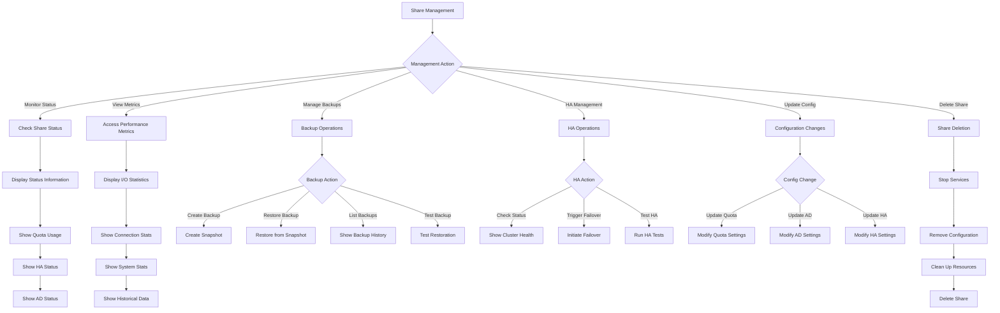

### 8. CLI Management Flow

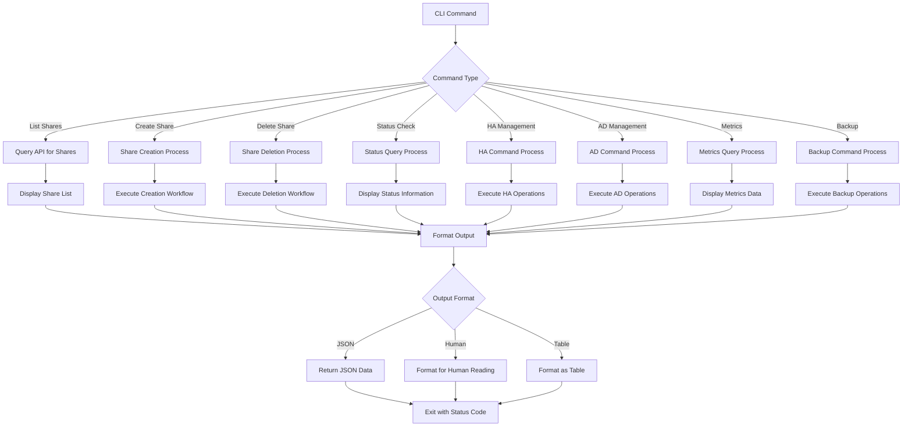

## User Decision Points

### Mode Selection Decision Tree

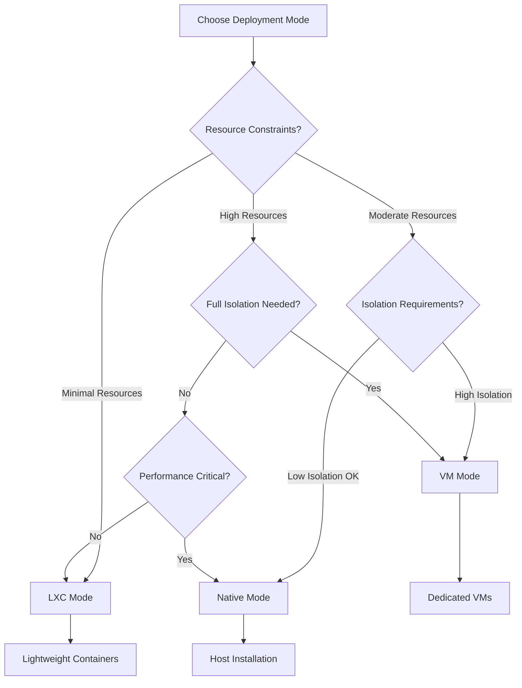

### Feature Selection Decision Tree

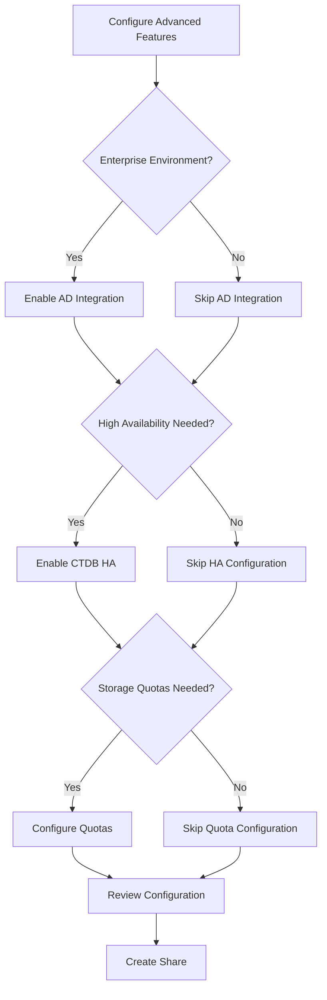

## Error Recovery Paths

### Common Error Scenarios

1. **Template Not Found**
   - Automatic template download
   - Manual template creation option
   - Fallback to generic templates

2. **AD Domain Join Failure**
   - Fallback to local authentication
   - Retry with different credentials
   - Manual domain join option

3. **CTDB Cluster Issues**
   - Automatic cluster reconfiguration
   - Manual cluster setup option
   - Fallback to single-node mode

4. **Quota Application Failure**
   - Fallback to different quota method
   - Continue without quotas
   - Manual quota setup option

5. **Resource Allocation Failure**
   - Automatic resource adjustment
   - Suggest alternative configurations
   - Manual resource allocation

## Success Metrics

### User Experience Metrics

- **Time to First Share**: < 5 minutes for basic setup
- **Success Rate**: > 95% for standard configurations
- **Error Recovery**: < 2 minutes for common errors
- **Feature Adoption**: > 80% for enterprise features

### Technical Metrics

- **Resource Usage**: < 80MB RAM for LXC mode
- **Provisioning Time**: < 30 seconds for LXC, < 2 minutes for VM
- **Failover Time**: < 30 seconds for HA failover
- **Backup Performance**: < 5% performance impact during backup

## Conclusion

The PVE SMB Gateway user process flow is designed to be:

1. **Intuitive**: Clear progression from basic to advanced features
2. **Flexible**: Multiple deployment modes and configuration options
3. **Robust**: Comprehensive error handling and recovery
4. **Efficient**: Optimized for common use cases
5. **Enterprise-Ready**: Full support for enterprise features
6. **User-Friendly**: Helpful guidance and validation throughout

The flow diagrams provide a complete picture of the user journey, from initial setup through ongoing management, ensuring users can successfully deploy and manage SMB shares in their Proxmox environment. 